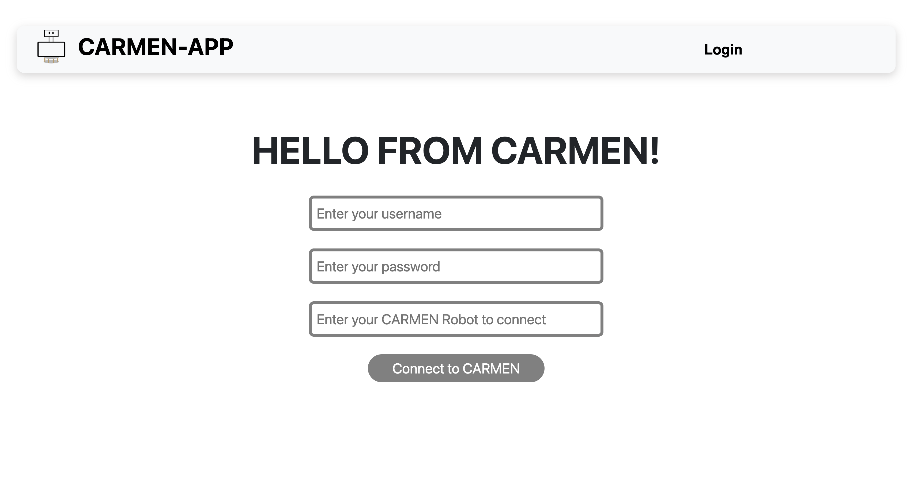
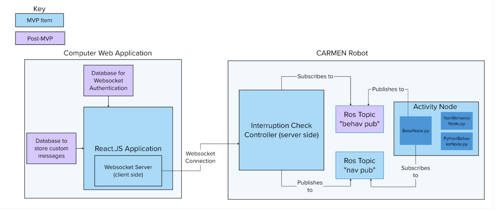

## About The Project

### Motivation - Why an Expert-in-the-Loop Interface for CARMEN?

1. **CARMEN: Cognitively Assistive Robot for Motivation and Neurorehabilitation**: 
[comment]: <> (what is carmen, who is involved in its usage, how is it currently being used, what is it's significance/how is it helpful)

3. **Expert-in-the-Loop Interface for CARMEN**:
[comment]: <> (when would an expert want to modify carmen's planned behaviors? how would they want to do that ---> our solution: CARMEN-APP)

---

### Abstract

The robot is currently used in an exploratory research setting to administer a behavioral intervention that is traditionally given in person by a clinician. We have developed it so that programmers can easily create sessions as informed by the existing intervention. The ultimate goal of the project in this class is to integrate an "expert-in-the-loop" control system into CARMEN so that an expert clinician watching the interaction between the robot and the user can "interrupt" scripted robot behavior with new behaviors. For example, if a user looked confused, and was taking a while to respond, the expert might send a request to the robot to explain the instructions once more. They could also specify the next activity they might want the user to perform. The expert-in-the-loop system consists of a web application run on a computer or laptop that a clinician uses to communicate to the robot to perform a specified behavior. 

---

### Team Members
- Anya Bouzida
- Kara Hoagland
- Pratyusha Ghosh
- Xinchen Xie

---

### Elevator Pitch

[Slides of Elevator Pitch](https://docs.google.com/presentation/d/1X-5zP_T8LLfxgnJf5mjk4AHbexQoV7Y8NyYjBcJjCSs/edit?usp=sharing)

### Project Specifications

[Document with Project Specifications](https://docs.google.com/document/d/10H6pUmHl3SZAczp-levR7cRhc9J_NGaACFJv8wNlcGw/edit?usp=sharing)

### Milestone Report

[Document on Milestone Progress](https://docs.google.com/document/d/1rjJsS09qILpKDAJw4Fnvlmxe1n0uVfqqQeGW1HdVCu0/edit?usp=sharing)

### Oral Update

[Slides of Oral Update](https://docs.google.com/presentation/d/12kv_HvILZ9NUuts5leJI20SAdBhx9o1TLjVrA0rFksk/edit?usp=sharing)

### Final Oral Presentation

[Slides of Final Oral Presentation](https://docs.google.com/presentation/d/1MFIHSK6prJjUNAwiYxMXdIeUGQSlZZ2laTrdMUac41g/edit?usp=sharing)

---

## Technical Documentation

### Repository Organization

This repository only contains the front-end code for the web app. The repository is organized as follows:

**./src** : Contains the code for the web application and includes a backend Node.js mock server for testing..

**./index.html**: Serves as the entry point for the web application.

---

### Deployment Steps

#### Frontend Deployment

The web application code can be found in the ./src files.
Clone the repository and follow these steps to run the application:
1. Fork this repository and clone the repository.
2. Run `npm install` to install the necessary dependencies.
3. Run `npm dev run` to start the application.

#### CARMEN Deployment

As the 

---

### Usage Instructions

1. Open the web application in a browser.
2. Enter your username and password, click on the "Connect to CARMEN" button.

3. The application is consisted of three pages. The `Logout Page` is used to log out the application. The `App Page` is used to insert interruptions. The `History Page` displays all the interruptions inserted.
4. You can navigate between the different pages of the application from the web application by clicking on the buttons on the navigation bar.

---

### Architecture Diagram

---

## Demo

### Version 1 Demonstration

[Link to Demo](https://drive.google.com/file/d/1l5EyJ71iEKnRkgLNaQvXFNTW-6tjZwfK/view?usp=sharing)

[comment]: <> (### Version 2 Demonstration

[Link to Demo](https://www.youtube.com/shorts/88xI9h5lxpY))

### Final Project Video

TBA: To be added by 6/12/2023

---

## Future Work
- Conversion to a native application
- Upgrading the location coordinates with Google Maps integration 
- Multiple bike tracking through a single application
- Integration with Bike Accessories
- Analytics and Reporting

